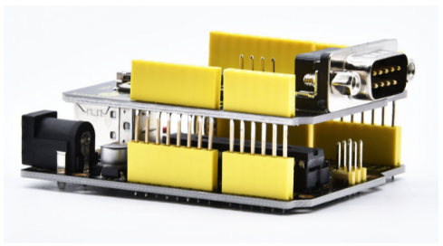
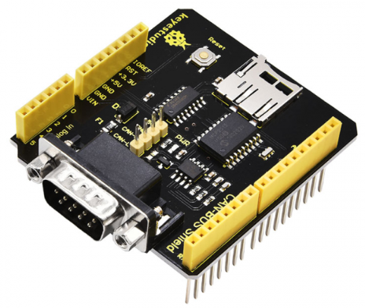
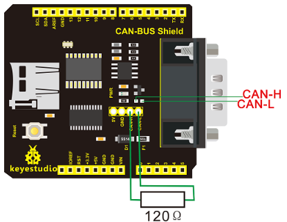
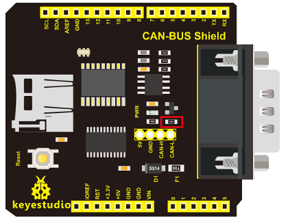
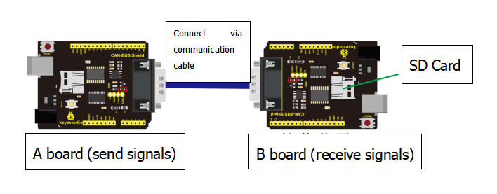
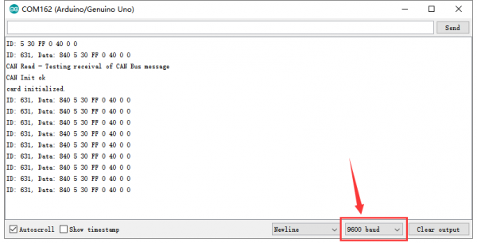

# KS0411 keyestudio CAN-BUS Shield


## 1. Introduction

keyestudio CAN-BUS Shield is particularly designed for Arduino controllers.

The onboard BUS control chip can realize the data control on the CAN bus and data communication between devices.

It is compatible with the Arduino UNO standard interface; can be perfectly adapted to the main control boards such as Arduino UNO and Leonardo. As shown below.



The shield provides a DB9 connector, so you can choose the interface according to your needs. It also comes with MicroSD card slot, so you can directly insert MicroSD card to store data. 

A variety of expansion interfaces allow users to get more convenience in the DIY process.

## 2. Technical Parameters

- Operating voltage: DC5V
- Chip: MCP2515
- Dimensions: 66mm * 54mm * 28mm
- Weight: 24g
- Environmental attribute: ROHS



## 3. Features

- Support standard frame, extended frame of transmission and reception; support two receiving methods: Polling and interrupt
- Provide various interfaces, such as uart, I2C, DB9 connector, etc.
- Support SD card data storage
- Support power supply via Arduino motherboard or DB9 connector

## 4. Terminal resistor

The two ends of CAN BUS(CAN-H and CAN-L) must be connected to terminal resistor so that CAN BUS can work normally. The resistance of terminal resistor should be as same as communication cable. Its typical value is 120 ohms. Additionally, it can match bus resistance to strengthen the anti-interference and reliability of data communication.



**Note: we can connect terminal resistor to the pin headers with 2.54mm in pitch, alternatively, solder it (or 0603 SMD resistor) on the SMD position.**

120 ohms is the result of short-distance resistance matching, if add it on long distance, the signals will get influenced，because the drive capacity of CAN is limited. The length of communication cable is 5km, the resistance of Loop line（CANH+CANL）is close to 250 ohms, if 120 ohms is added, the voltage of transceiver at the terminal receiving point is only about 1V. This kind anti-interference of voltage amplitude is extremely poor, thus, communication will be unstable.

Therefore, in long distance communication, we recommend you to add 300 ohms-500ohms terminal resistor, which can ensure the signal amplitude is above 1.2V.

## 5. Test Method

**Library files and code download：**    [Resources](./Resources.7z)

**A. Solder terminal resistor**

Next, we communicate to test if shield works normally via 2 expansion boards and 2 UNO R3 boards. Before testing, we firstly connect a terminal resistor on 2 expansion boards, as shown below, terminal resistor is 120 ohms (0603 SMD resistor).



B. Upload test code Separately upload two test codes on 2 UNO R3 boards, one is for sending signals, another one is for receiving signals.

**Code for sending signals**

```c
#include <Canbus.h>
#include <defaults.h>
#include <global.h>
#include <mcp2515.h>
#include <mcp2515_defs.h>

void setup() 
{
  Serial.begin(9600);
  Serial.println("CAN Write - Testing transmission of CAN Bus messages");
  delay(1000);
  
  if(Canbus.init(CANSPEED_500))  
//Initialise MCP2515 CAN controller at the specified speed
  Serial.println("CAN Init ok");
  else
  Serial.println("Can't init CAN");
  delay(1000);
}

void loop() 
{
	tCAN message;
    message.id = 0x631; //formatted in HEX
    message.header.rtr = 0;
    message.header.length = 8; //formatted in DEC
    message.data[0] = 0x40;
	message.data[1] = 0x05;
	message.data[2] = 0x30;
	message.data[3] = 0xFF; //formatted in HEX
	message.data[4] = 0x00;
	message.data[5] = 0x40;
	message.data[6] = 0x00;
	message.data[7] = 0x00;
	mcp2515_bit_modify(CANCTRL, (1<<REQOP2)|(1<<REQOP1)|(1<<REQOP0), 0);
	mcp2515_send_message(&message);
	delay(1000);
}
```

**Code for receiving signals**

```c
#include <Canbus.h>
#include <defaults.h>
#include <global.h>
#include <mcp2515.h>
#include <mcp2515_defs.h>
#include <SPI.h>
#include <SD.h>
const int chipSelect = 9;

void setup() 
{
  Serial.begin(9600); // For debug use
  pinMode(chipSelect, OUTPUT);
  Serial.println("CAN Read - Testing receival of CAN Bus message");  
  delay(1000);
  if(Canbus.init(CANSPEED_500))  //Initialise MCP2515 CAN controller at the specified speed
    Serial.println("CAN Init ok");
  else
    Serial.println("Can't init CAN");
  delay(1000);
  if (!SD.begin(chipSelect)) 
  {
    Serial.println("Card failed, or not present");// don't do anything more:
    return;
  }
  Serial.println("card initialized.");
}

void loop()
{
   tCAN message;
  if (mcp2515_check_message()) 
  {
    if (mcp2515_get_message(&message)) 
  	{
        //if(message.id == 0x620 and message.data[2] == 0xFF)  
        //uncomment when you want to filter
        //{
         Serial.print("ID: ");
         Serial.print(message.id,HEX);
         Serial.print(", ");
         Serial.print("Data: ");
         Serial.print(message.header.length,DEC);
         for(int i=0;i<message.header.length;i++) 
         { 
             Serial.print(message.data[i],HEX);
             Serial.print(" ");
          }
          Serial.println("");
          //}
       }
    }
}
```

## 6. Wiring Method

After uploading test code on 2 UNO R3 boards, wire to test according the following method.



Note: need to connect a SD card to the expansion board which is used for receiving signals.

## 7. Test Result

Wire and supply power for A board, link B board with computer via USB cables, open serial monitor, set baud rate to 9600, you could see the information sent by A board.

